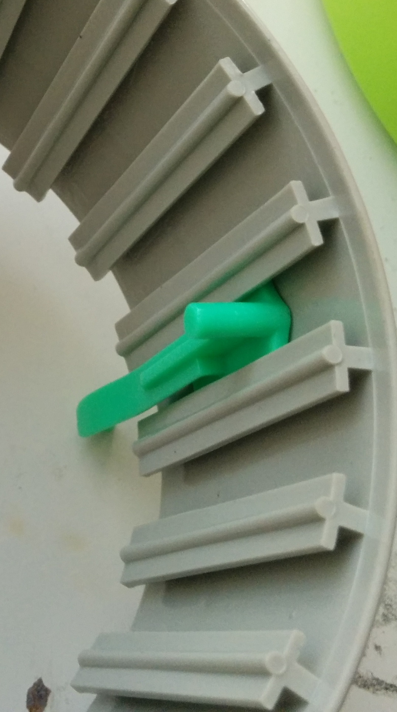
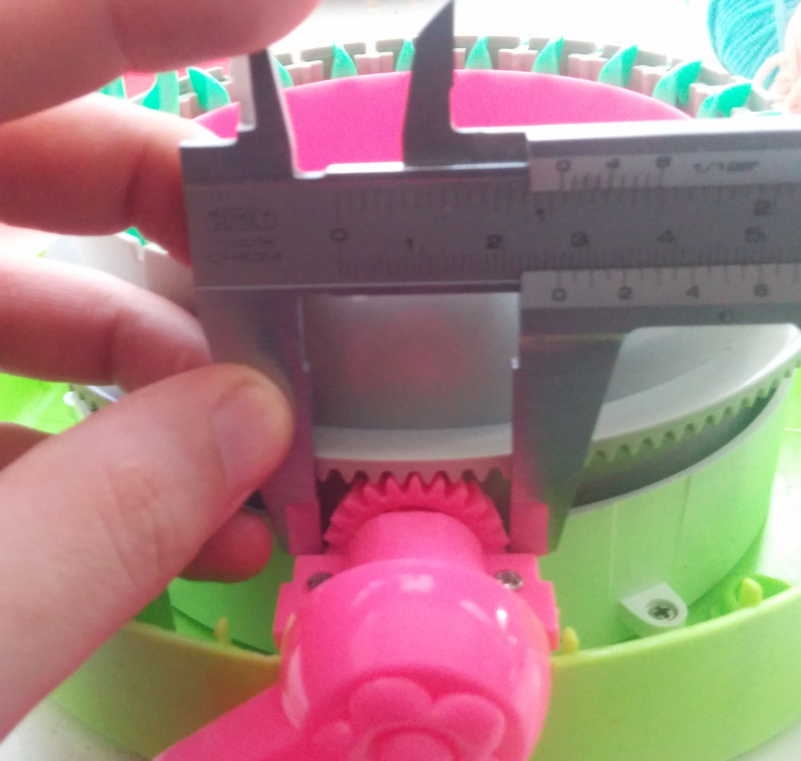
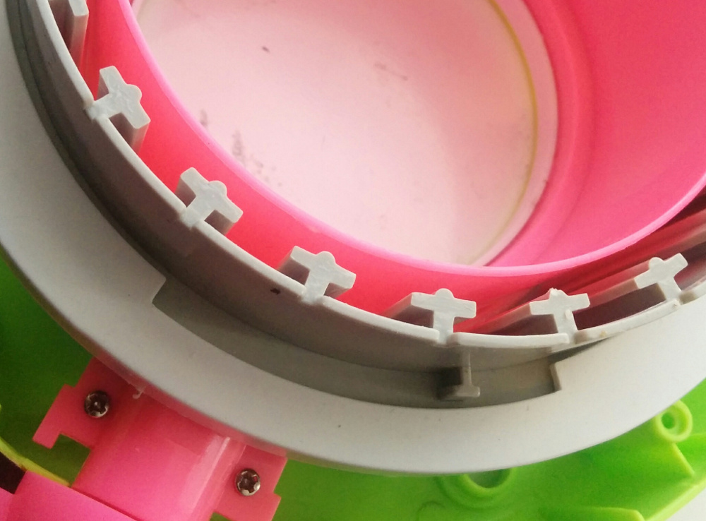
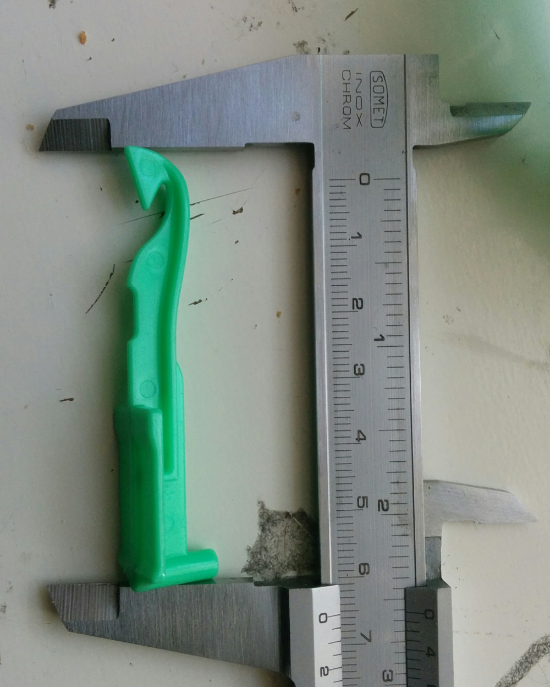
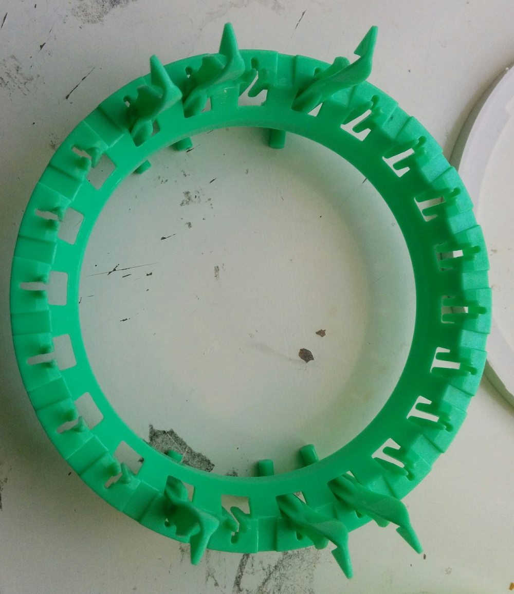
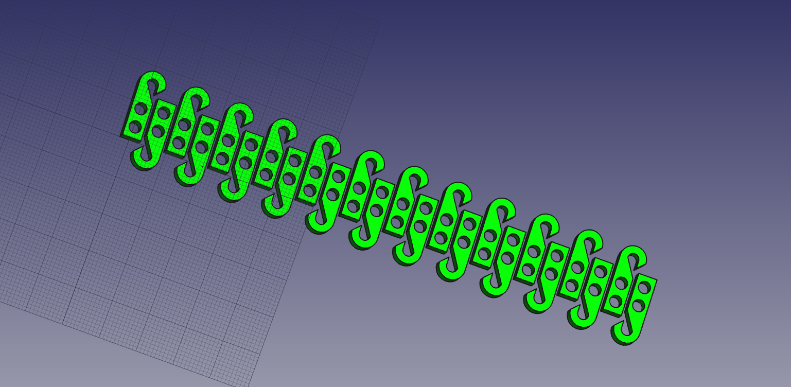

Idda is a project to develop an open-source 3d-printable circular knitting machine.

We aim for a cheap hobby-grade knitting machine, that can be used to produce clothing (or parts for),
as well as fabric for technical use. It will be similar to existing commercial units,
but also be adaptable to make different fabric sizes and using different materials - and support automation.

As a side-effect of developing, we're also creating replacement parts and modifications
for existing commercial units, as well as tools that are useful for any kind of (circular knitting) machine.

We've started reverse engineering and modified a commercial unit.
Here the crank is 3d-printed, and a 3d-printed + laser-cut motor attachment has been added for automated knitting:


# Status
**Prototyping**

* [Teardown](#teardown) of a commercial unit has been performed
* A functional crank and [motor attachment](#crank-motor-attachment) for automated knitting has been tested with existing commercial unit
* [*Untested 3d-models*](#in-development) exist for the components of the knitting mechanism

If you want a functional open-source knitting machine that you can make *right now*,
you should have a look at [Circular Knitic](http://www.instructables.com/id/Circular-Knitic/) or
the [OpenKnit](http://openknit.org/) linear/flatbed knitting machine.

If you don't care about the machine being open-source or customizable, then you can
buy these kind of machines cheaply from [many manufactures](#background) right now.

# TODO

v0.1: First prototype

* Needle: Test 3d-printability, including best print direction and possible
* Needle: Adapt and test using as replacement in commercial unit
* Track: Adapt the track path to be a V-shape, as found in the commerical units
* Test motion of fully 3d-printed track+needle+cylinder together
* Track: Make the actual track be circular
* Model the circular rack, used to drive the cylinder around. Connects to existing crankaxel
* Model a basic outer body/shell

v1.0: First fully-working manual version

* Tweak for printability, including speed
* Model some feet for body to stand on
* Parametric model, tested in couple different sizes

v2.0: Fully-working automated version

* Add parts needed for motor drive, including electronics and software

Later

* Automated plain-knitting using end-stops/encoder

# License

Idda is primarily licensed under [CC-BY 4.0](https://creativecommons.org/licenses/by/4.0/).
By providing pull requests you agree that your work can be distributed this license.

Note that **some files are currently derivatives of files licensed as CC-BY-SA**, and are thus also under CC-BY-SA.

You are free to:

```
    Share — copy and redistribute the material in any medium or format
    Adapt — remix, transform, and build upon the material - for any purpose, even commercially.

    The licensor cannot revoke these freedoms as long as you follow the license terms.
```

Under the following terms:
```
    Attribution — You must give appropriate credit, provide a link to the license, and indicate if changes were made.
    You may do so in any reasonable manner, but not in any way that suggests the licensor endorses you or your use.

    No additional restrictions — You may not apply legal terms or technological measures that legally restrict others from doing anything the license permits.

```

Please attribute by linking to this Github repository: `https://github.com/jonnor/idda-knitting-machine`.

# In development

There are some FreeCAD source files included here.

[Needle](./needle.fcstd)


[Track](./track.fcstd)


## Background

Hobby circular knitting machines are now sold by a number of manufacturers under various names, including
`Addi Express`, `Innovations Knitting machine`, `Singer Knitting Machine`,
`Barbie / Mattel Knitting machine`, `PRYM Strickmühle` and generic `DIY scarf hat knitting machine`.

These machines are all minor variations on the patent
[US 6360566 B1: Household circular knitting machine](http://www.google.com/patents/US6360566) (lapsed).

One of the key features is that it does not use the typical knitting needle (latched needles).
This needle type and mechanism is described in the original Mattel patent,
[US3983719 A: Knitting needle](http://www.google.com/patents/US3983719) from 1976 (now long expired).

The machine is also similaries to [US 6276986 B1: Toy knitting machine](http://www.google.com/patents/US6276986) (lapsed).

## History

The project was initially started at CCC31 in December 2014,
where Hong Phuc presented [Let’s build our own personalized open textile production line](https://media.ccc.de/v/31c3_-_6447_-_en_-_saal_6_-_201412271400_-_let_s_build_our_own_personalized_open_textile_production_line_-_hong_phuc_dang)
([on YouTube](https://www.youtube.com/watch?v=n0FZdl7LBbk)), calling for open-source machines.
Based on pictures and videos available on the internet, the basic mechanism was reverse engineered and modelled.

It was not until May 2016, that we actually got hands on a unit and started making functional parts and testing them.

## Related projects

One can use open-source software to knit
[.JPG patterns on Brother KH-930e](https://www.youtube.com/watch?v=GhnTSWMMtdU&index=3&list=LLB9kP5NQGu0JLWa9UlkxklQ),
by emulating a serial floppy drive with a modified USB-serial adapter.

[Knitic](http://knitic.com/) project has developed open-source replacement electronics for Brother flatbed knitting machines,
in the project ([demo video](https://www.youtube.com/watch?v=ShXOvGzu60U)).

[AYAB - all yarns are beautiful](http://ayab-knitting.com/) provides hardware kits and software
for making Brother KH-family computer-controlled.

[KnitWeb](https://github.com/fossasia/knitweb) by [FashionTec](https://fashiontec.wordpress.com/)
provides a graphical user interface for creating knitting patterns, and sending them to knitting machine.


## How to use

Basics

* [Youtube: How to thread (Innovations 42)](https://www.youtube.com/watch?v=0SZPREeMlgU)
* [Youtube: Knitting flat panels (Addi Express)](https://www.youtube.com/watch?v=_O2npMrNRbY)

Advanced

* [Youtube: Croque cast-on and making pointed panel (Innovations 42)](https://www.youtube.com/watch?v=du3rM5xAC4E)
* [Youtube: 1x1 ribbint (Innovations 42)](https://www.youtube.com/watch?v=4g534u90JPw)
* [Youtube: Fairisl, alternating color patterns (Addi)](https://www.youtube.com/watch?v=szqzJ5g-WUQ)

Debugging & Maintenance

* [Youtube: Tips&Tricks Addi Express](https://www.youtube.com/watch?v=cgz758TeJh0)

## Teardown

Following is a quick teardown of the internals of a commercial circular knitting machine. In particular
[BangGood: DIY scarf hat knitting machine](http://www.banggood.com/Creative-DIY-Scarf-Hat-Quick-Knitting-Machine-Handheld-Handwork-Weaving-Tool-for-Adult-Child-p-1030934.html),
purchased for testing on May 03 2016 for 30 EUR.

The mechanisms found here are expected to be representative, or nearly identical to most of the other machines.

### Mechanical principle






* A bevel gear connects the hand-crank axel to the inner unit (seen externally as green, some internal parts in grey-white).
* The inner unit contains 22 needles, each in a compartment that constains movement to up/down
* The body which the inner unit rotates in, has a track which the needles follow
* As you turn the crank, the inner unit rotates
* A needles are rotated around to come to the thread insertion point, the track causes them to raise - catching the thread - and then lower again
* ...


### Needle track


The scissoring action caused by the inner and outer track parts is smart,
as it minimizes contact surface and thus friction.

Similar two-point connection was found in the axel connector for the crank.

### Plain knit stopper




* A lever allows to switch between 'tube knit' and 'plain knit'
* With plain knit, stoppers for rotation is enabled
* Have to knit forward to stop, then backward to stop, and so on

### Needle






## Mods

### Crank motor attachment

Status: **Minimally useful**. [Video of initial test](https://www.youtube.com/watch?v=loaOWbuzrhs).


[FreeCAD source](./motorattach.fcstd)|

TODO v1, minimally useful

* Slightly bigger pulley on motor?
* Maybe need to add a tensioning idler?
* Produce first useful object. Simple tube socks?

TODO v2, works stand-alone (not tethered to computer):

* Define desired stand-alone functionality.
Potmeter for speed-control, button for start/stop, LED for status? Maybe also button+LED for direction?
* Create firmware
* Create electronics-board.
Either a shield for Arduino Uno, or a base-board using Arduino Nano.
Should use A4988 or DRV8825

The bevel gear was created using the FreeCAD macro/workbench [FCGear](http://www.freecadweb.org/wiki/index.php?title=Macro_FCGear).

The pulley is for GT2 timing belts. It was created with from [Parametric Pulley OpenSCAD](http://www.thingiverse.com/thing:16627/#files),
using the following parameters. It was done in the OpenSCAD workbench in FreeCAD, to get a solid instead of a mesh.

```
teeth = 28;			// Number of teeth, standard Mendel T5 belt = 8, gives Outside Diameter of 11.88mm
profile = 12;		// 1=GT2

motor_shaft = 12.2;	// NEMA17 motor shaft exact diameter = 5
m3_dia = 3.2;		// 3mm hole diameter
m3_nut_hex = 1;		// 1 for hex, 0 for square nut
m3_nut_flats = 5.7;	// normal M3 hex nut exact width = 5.5
m3_nut_depth = 2.7;	// normal M3 hex nut exact depth = 2.4, nyloc = 4

retainer = 1;		// Belt retainer above teeth, 0 = No, 1 = Yes
retainer_ht = 1.5;	// height of retainer flange over pulley, standard = 1.5
idler = 1;			// Belt retainer below teeth, 0 = No, 1 = Yes
idler_ht = 1.5;		// height of idler flange over pulley, standard = 1.5

pulley_t_ht = 7.5;	// length of toothed part of pulley, standard = 12
pulley_b_ht = 0;		// pulley base height, standard = 8. Set to same as idler_ht if you want an idler but no pulley.
pulley_b_dia = 22;	// pulley base diameter, standard = 20
```


Pulley on the motor
```
teeth = 28;			// Number of teeth, standard Mendel T5 belt = 8, gives Outside Diameter of 11.88mm
profile = 12;		// 1=MXL 2=40DP 3=XL 4=H 5=T2.5 6=T5 7=T10 8=AT5 9=HTD_3mm 10=HTD_5mm 11=HTD_8mm 12=GT2_2mm 13=GT2_3mm 14=GT2_5mm

motor_shaft = 4.2;	// NEMA17 motor shaft exact diameter = 4
m3_dia = 3.2;		// 3mm hole diameter
m3_nut_hex = 1;		// 1 for hex, 0 for square nut
m3_nut_flats = 5.7;	// normal M3 hex nut exact width = 5.5
m3_nut_depth = 2.7;	// normal M3 hex nut exact depth = 2.4, nyloc = 4

retainer = 1;		// Belt retainer above teeth, 0 = No, 1 = Yes
retainer_ht = 1.5;	// height of retainer flange over pulley, standard = 1.5
idler = 0;			// Belt retainer below teeth, 0 = No, 1 = Yes
idler_ht = 1.5;		// height of idler flange over pulley, standard = 1.5

pulley_t_ht = 7;	// length of toothed part of pulley, standard = 12
pulley_b_ht = 8;		// pulley base height, standard = 8. Set to same as idler_ht if you want an idler but no pulley.
pulley_b_dia = 20;	// pulley base diameter, standard = 20
no_of_nuts = 1;		// number of captive nuts required, standard = 1
nut_angle = 90;		// angle between nuts, standard = 90
nut_shaft_distance = 1.2;	// distance between inner face of nut and shaft, can be negative.
```

Closed loop belt. Can be printed in NinjaFlex Semiflex using
OpenSCAD parametric [timing belt generator](https://www.youmagine.com/designs/parametric-timing-belt-generator).
```
belting("loop","GT2_2mm", belt_length=228, belting_width = 6, backing_thickness=0.8 );
```
Best results when hacking Cura nozzle size to make it avoid doing partial infills with jogs in between.
Might be worthwhile to go up a little bit in thickness for less flexibility.

Alternatively one can buy it, ie [from Robodigg](http://www.robotdigg.com/product/282).

## Ideas

## Automation

* Add end-stops for crank-motor, to support automated plain-knitting.
Alternative is to use an encoder mechanism, which may be useful also for other things.
Linear type knitting machines seem to
* Automated swapping of thread, by fusing/tying one yarn to another.
* Programmable moving of thread guide position. For automatic cast-on/off.
If able to manipulate 2 threads can do color patterns (like Fairisl).


## Tools

### Weight hooks

For keeping some tension in the knitted fabric, it is advisable to hang some weights on it.
This makes the loops more evenly spaced, and gives more reliable operation.



There are quite general, can be used on any size machine - linear or circular.
Just print the number needed, and tie together with a string. And then hang weights in the string.

A bit time-consuming to set up, as each individual one must be hooked manually and moves around very easily.
For use on a specific machine, would maybe be better to design quarter-circles
which would fit perfectly and hook many loops at the same time.


## Alternate uses
... apart from creating clothing.

Light-weight construction tubes/trusses using polyester/epoxy resin. Possibly these could be continiously 'extruded',
by having the knitted thread be soaked/sprayed with resin right after being knitted. Then solidifying,
possibly assisted by heating to ~60 deg C.

Fiber for strengthening custom parts. For instance, using vacum-bagging.

Probably requires using a high-strength fiber like nylon, linen, jute, slik, fiberglass or carbon fiber.
Perhaps one can knit braided / multifilament fishing line (PE, nylon or fluocarbon),
thought these may have coatings that prevent resin filling?. They are cheap, and looks to be available up to 1-2 mm thickness.
Examples of carbon fiber yarn is [Zoltek PX-30](http://zoltek.com/products/panex-30/yarns/), and glass fiber is
[PPG E-glass](http://www.ppgfiberglass.com/Products/Yarn.aspx)


[Quick demo of knitting with (elamelled) wires](https://www.youtube.com/watch?v=okO2RyFfPE4), for artistic effect.
Could possibly be used to make sparse metal structures, by later soldering together joints?


References
----------

* [Replacement needles](http://www.amazon.com/Express-Knitting-Machine-Replacement-Needles/dp/B004T2MHVA) for Adda Express
* [Listing of different circular knitting machines](http://www.kobakant.at/DIY/?p=1144).
[PRYM 624170 Strickmühle MAXI](http://www.amazon.de/PRYM-624170-Strickm%C3%BChle-MAXI/dp/B000VKFJ32/ref=sr_1_4?ie=UTF8&s=garden&qid=1245759008&sr=8-4) seems to be the cheapest 44 needle, at around 50 EUR.
* Barbie / Mattel also has a [circular knitting machine](https://www.flickr.com/photos/plusea/3675240262)
* [List of antique manufacturers](cskms.org/where-to-find-a-csm/) for "circular sock machines".
These are often made of steel, as small-scale industrial units dating back to late 1800.

Research

* [How to knit carbon fiber](http://www.materialsviews.com/how-to-knit-carbon-fibers/)
* [Development of 3D knitted fabrics for advanced composite materials](http://cdn.intechopen.com/pdfs-wm/14297.pdf)

Random

* Vacum bags [1](http://www.clasohlson.com/no/Vakuumpose/34-3518) [2](http://www.clasohlson.com/no/Vakuumposer/34-3517)

Other opensource work

* [OpenKnit](http://openknit.org/), an open source linear/flatbed knitting machine
* [Knitic](http://), replacement electronics for Brother flatbed knitting machines. Streaming control via computer. [demo video](https://www.youtube.com/watch?v=ShXOvGzu60U)
* [Becky Stern: .JPG patterns on Brother KH-930e](https://www.youtube.com/watch?v=GhnTSWMMtdU&index=3&list=LLB9kP5NQGu0JLWa9UlkxklQ),
by emulating a serial floppy drive with a modified USB-serial adapter.
* [The TwitterKnitter](https://eirebecky.wordpress.com/2013/08/02/the-twitterknitter/), software-controller knitting by emulating punchcards using some lasercut parts and servos.

## Stiching

Theory behind knitting in general

* Weft versus waft
* Single knit types: knit, tuck, float  [video](https://www.youtube.com/watch?v=mWB8JReKTuY).
* Tuck gives a mesh-like appearance. Used for instance for pique shirts
* Float are used for color patterns, bringing different yarns to front. Also uses as basis of fleece
* Double knit types [double jersey](https://www.youtube.com/watch?v=ho9Ut9uzsGI), rib-gating and interlock-gating
Realized by having two sets of needles which can work independently, interleaving odd/even along knitting path.
For instance on a circularg knitting machine, one set forms a disc, pointing out in cylinder, another set is along the cylinder, pointing up.
Alternatively on a linear V-bed machine, two flatbeds form a V, each side with a separate needle set.
* [Rib-gated](https://www.youtube.com/watch?v=wMvjGS8dQpU) knits. 1x1 and 2x2.

## Needles

The Addi-style machines uses a plain hook needle, and there is a V in the body where the loop sits while the needle goes through.
Most other types of knitting machines requires other, more advanced needles.
Even the Circular Knitic seems to use latched needles.
Currently such needles are speciality parts. Being able to 3d-print would make the machines more reproducable.

How the different needle types work

* [Stitch Formation with Latch Needle](https://www.youtube.com/watch?v=Ivhs7yGQm7I)
* [Stitch Formation with bearded Needle](https://www.youtube.com/watch?v=rh4pSj-DecM)
* [Stitch Formation with compund Needle](https://www.youtube.com/watch?v=xLhVy_F2oik)

Bearded needles are simpler than latch needles, but requires more complex machinery as something has to press the hook down to close.
With latches the sideways motion of the yarn causes hook closing automatically.

The [Singer spool knit machine](https://www.youtube.com/watch?v=QR-hAb7KTn8) looks to have plastic / injection molded latch needles.

### 3d-printed latch needle

An attempt was made at reproducing a latched needle from a Bond knitting machine (XKN8).
It was modelled as-is based on a [reference picture from OpenKnit mailing list](https://groups.google.com/forum/#!topic/openknit/KgyJhvOa6Hc),
and printed with PLA on a PrintrBot FDM 3d-printer.


[FreeCAD source](./latch-needle.fcstd) |

As expected, the features of the latch mechanism - especially the rivet which makes up the pivot point was too small to be reproduced in a functional manner.
The rivet was less than 1 mm in diameter, and broke when attempting to loosen it from the print-in-place part.
The hook which was only 0.8 mm wide (and 3 mm tall), was however suprisingly strong.
It is estimated that a 5mm tall needle, with 5 mm wide stem at the widest is the lower practical limit on needle size.


## Spool knitting machines

A related type of machine, also available cheaply allows to make "i-cord".
Typically has 4 (latch) needles.

Examples

* Embellish Knit Automatic Spool Loom [video](https://www.youtube.com/watch?v=z9tgjUBpmLA)
* http://www.amazon.com/PRYM-PRYM_624145-Knitting-Mill/dp/B000TQHWP6
* Singler spool knit
* https://www.youtube.com/watch?v=lxpya0KP7jU
* Swe Mate [video](https://www.youtube.com/watch?v=rAoylAqsxsc)
* PRYM [amazon.de](http://www.amazon.de/ADDI-PRYM_624145-Prym-624145-Strickm%C3%BChle/dp/B000TQHWP6/ref=pd_sim_201_2?ie=UTF8&dpID=51yXX%2BSufFL&dpSrc=sims&preST=_AC_UL160_SR160%2C160_&refRID=1PVAMW5VYQDNDV3J6D7D)

How to

* http://techknitting.blogspot.no/2010/01/i-cord-from-mill.html

Uses

* [Making a stretch sensor](https://www.youtube.com/watch?v=QR-hAb7KTn8), by embedding conductive yarn
* braided sleeves for cables etc
* 
