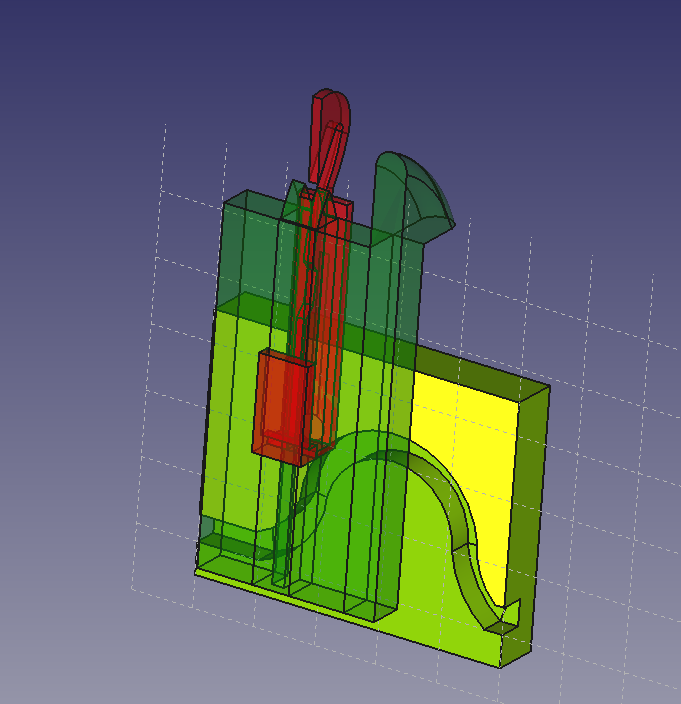

Idda: A circular knitting machine
==================

Reverse engineered from the [Addi Express](https://www.google.no/?#q=addi+express).

Features

* 22 or 46 needle. 
* Can create circular and rectangular swatches (using back-and-forth knit)
* Max swatch for 46 needle: 17.75 inch
* Manual cast-on and bind-off
* Manual forwarding

Motivation

* Be able to replicate using distributed digital manufacturing (3d-print/CNC)
* Be able to customize. Different number of needles, needle/mask size, adapting to different materials, adding automation

Status
--------
**Paused**

The [Circular Knitic](http://www.varvarag.info/circular-knitic)
[(Github)](https://github.com/var-mar/circular_knitic)
[(docs)](http://issuu.com/marcanet/docs/circular_knitic_documentation)
is an open source functional implementation of the same mechanism as Idda.

We propose that further development is done as improvements to the base provided by the Circular Knitic.
For instance allowing it to be:

* Configured for different sizes
* Be reproducable with only one digital fabrication machine (need only 3d-print OR laser/CNC)
* Use less special parts (like steel needles and aluminum profiles)
* Improve the portability

There are some FreeCAD source files included here.

[Needle](./needle.fcstd)


[Track](./track.fcstd)




## How to use

Basics

* [Youtube: How to thread (Innovations 42)](https://www.youtube.com/watch?v=0SZPREeMlgU)
* [Youtube: Knitting flat panels (Addi Express)](https://www.youtube.com/watch?v=_O2npMrNRbY)

Advanced

* [Youtube: Croque cast-on and making pointed panel (Innovations 42)](https://www.youtube.com/watch?v=du3rM5xAC4E)
* [Youtube: 1x1 ribbint (Innovations 42)](https://www.youtube.com/watch?v=4g534u90JPw)
* [Youtube: Fairisl, alternating color patterns (Addi)](https://www.youtube.com/watch?v=szqzJ5g-WUQ)

Debugging & Maintenance

* [Youtube: Tips&Tricks Addi Express](https://www.youtube.com/watch?v=cgz758TeJh0)

## Teardown

Of a cheap China clone from China.

`TODO: post pictures/video`

* Mechanical principle
* Needle guide
* Stopper for plain-knit

## Mods

### Crank motor attachment

Status: **Proof-of-concept**. [Video of initial test](https://www.youtube.com/watch?v=loaOWbuzrhs).


[FreeCAD source](./motorattach.fcstd)|

TODO: 

* Design bracket for stepper-motor. Needs slots for belt adjustment
* Switch to use GT-2 belts
* Run some longer tests

The bevel gear was created using the FreeCAD macro/workbench [FCGear](http://www.freecadweb.org/wiki/index.php?title=Macro_FCGear).

The pulley is for MXL timing belts. It was created with from [Parametric Pulley OpenSCAD](http://www.thingiverse.com/thing:16627/#files),
using the following parameters. It was done in the OpenSCAD workbench in FreeCAD, to get a solid instead of a mesh.

```
teeth = 28;			// Number of teeth, standard Mendel T5 belt = 8, gives Outside Diameter of 11.88mm
profile = 1;		// 1=MXL

motor_shaft = 12.2;	// NEMA17 motor shaft exact diameter = 5
m3_dia = 3.2;		// 3mm hole diameter
m3_nut_hex = 1;		// 1 for hex, 0 for square nut
m3_nut_flats = 5.7;	// normal M3 hex nut exact width = 5.5
m3_nut_depth = 2.7;	// normal M3 hex nut exact depth = 2.4, nyloc = 4

retainer = 1;		// Belt retainer above teeth, 0 = No, 1 = Yes
retainer_ht = 1.5;	// height of retainer flange over pulley, standard = 1.5
idler = 1;			// Belt retainer below teeth, 0 = No, 1 = Yes
idler_ht = 1.5;		// height of idler flange over pulley, standard = 1.5

pulley_t_ht = 7.5;	// length of toothed part of pulley, standard = 12
pulley_b_ht = 0;		// pulley base height, standard = 8. Set to same as idler_ht if you want an idler but no pulley.
pulley_b_dia = 22;	// pulley base diameter, standard = 20
```

### Ideas

* 3d-printable replacement needles
* End-stops for crank-motor, to support automated plain-knitting
* Automated swapping of thread, by fusing/tying one yarn to another.
* Programmable moving of thread guide position. For automatic cast-on/off.
If able to manipulate 2 threads can do color patterns (like Fairisl).

## Alternate uses
... apart from creating clothing.

Light-weight construction tubes/trusses using polyester/epoxy resin. Possibly these could be continiously 'extruded',
by having the knitted thread be soaked/sprayed with resin right after being knitted. Then solidifying,
possibly assisted by heating to ~60 deg C.

Fiber for strengthening custom parts. For instance, using vacum-bagging.

Probably requires using a high-strength fiber like nylon, linen, jute, slik, fiberglass or carbon fiber.
Perhaps one can knit braided / multifilament fishing line (PE, nylon or fluocarbon),
thought these may have coatings that prevent resin filling?. They are cheap, and looks to be available up to 1-2 mm thickness.
Examples of carbon fiber yarn is [Zoltek PX-30](http://zoltek.com/products/panex-30/yarns/), and glass fiber is
[PPG E-glass](http://www.ppgfiberglass.com/Products/Yarn.aspx)


References
----------

* [Replacement needles](http://www.amazon.com/Express-Knitting-Machine-Replacement-Needles/dp/B004T2MHVA) for Adda Express
* [BangGood: DIY scart hat knitting machine](http://www.banggood.com/Creative-DIY-Scarf-Hat-Quick-Knitting-Machine-Handheld-Handwork-Weaving-Tool-for-Adult-Child-p-1030934.html),
a cheap copy (30 USD) with 22 needles. I purchased one of these for testing on May 03 2016.
* [Listing of different circular knitting machines](http://www.kobakant.at/DIY/?p=1144).
[PRYM 624170 Strickmühle MAXI](http://www.amazon.de/PRYM-624170-Strickm%C3%BChle-MAXI/dp/B000VKFJ32/ref=sr_1_4?ie=UTF8&s=garden&qid=1245759008&sr=8-4) seems to be the cheapest 44 needle, at around 50 EUR.
* Barbie / Mattel also has a [circular knitting machine](https://www.flickr.com/photos/plusea/3675240262)
* [List of antique manufacturers](cskms.org/where-to-find-a-csm/) for "circular sock machines".
These are often made of steel, as small-scale industrial units dating back to late 1800.

Research

* [How to knit carbon fiber](http://www.materialsviews.com/how-to-knit-carbon-fibers/)
* [Development of 3D knitted fabrics for advanced composite materials](http://cdn.intechopen.com/pdfs-wm/14297.pdf)

Random

* Vacum bags [1](http://www.clasohlson.com/no/Vakuumpose/34-3518) [2](http://www.clasohlson.com/no/Vakuumposer/34-3517)
